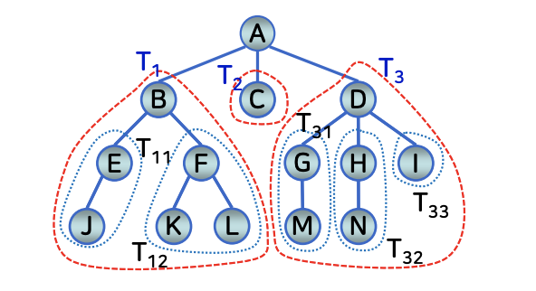
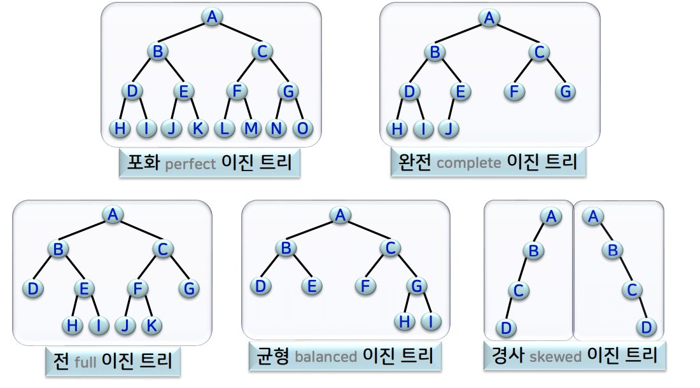
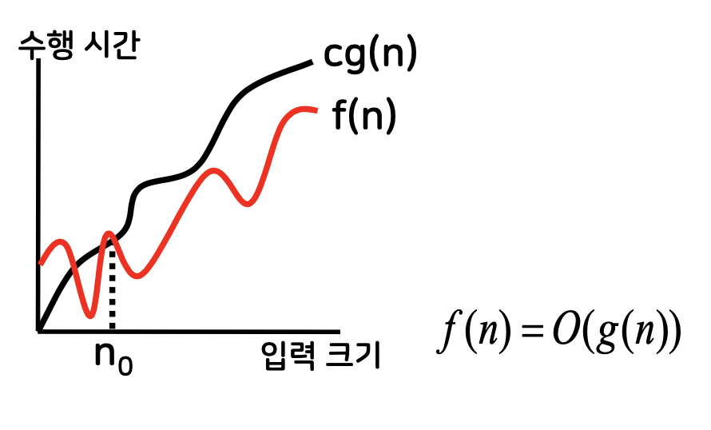
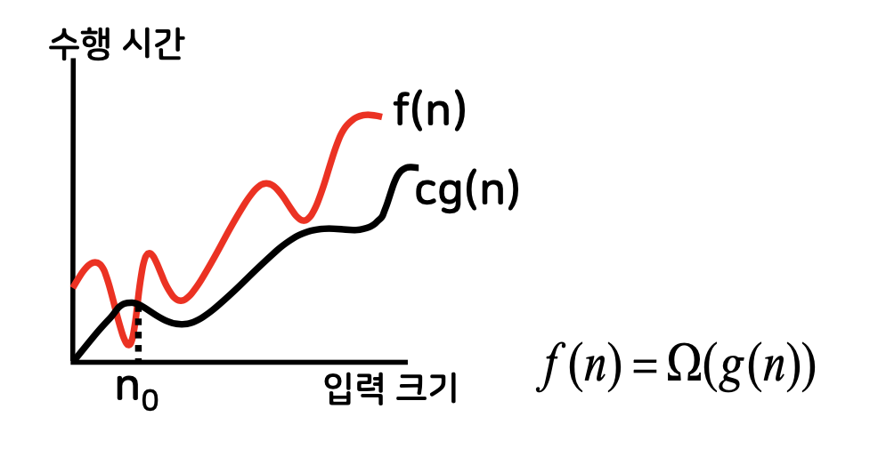
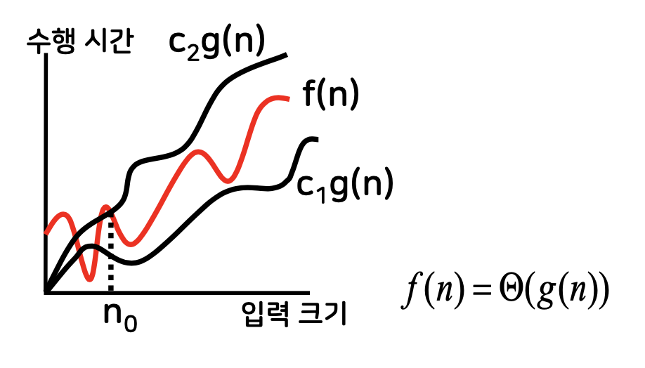
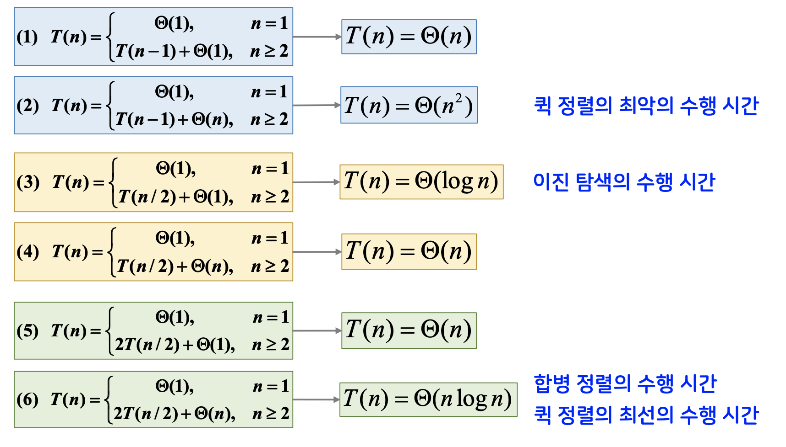

# 알고리즘 강의 요약 

* 기본 자료구조
  * 선형 자료구조
  * 비선형 자료구조
* 알고리즘 기초
  * 알고리즘 분석
  * 점근 성능
* 분할정복 알고리즘
  * 이진 탐색
  * 합병 정렬
  * 퀵 정렬
  * 선택 문제
* 동적 프로그래밍 알고리즘
* 욕심쟁이 알고리즘
* 정렬 알고리즘
  * 버블 정렬
  * 선택 정렬
  * 삽입 정렬
  * 셸 정렬
  * 퀵 정렬
  * 합병 정렬
  * 계수 정렬, 기수 정렬
* 탐색 알고리즘
  * 순차 탐색
  * 이진 탐색
  * 탐색 트리
  * 해싱
* 근사 알고리즘
  * NP-완전 문제


# 기본 자료 구조

## 선형 자료 구조

- 배열
- 연결 리스트
- 스택
- 큐

### 배열

- 같은 자료형을 갖는 여러 원소를 하나의 변수 이름으로 모아놓은 데이터의 집합
- 인덱스를 통한 직접적인 원소 접근 → 빠르고 동일한 접근 시간
- 삽입/삭제 시 추가적인 자료 이동에 따른 시간 오버헤드 발생

### 연결 리스트

- 데이터 필드와 링크 필드로 이루어진 노드라는 저장 구조를 이용
- 비교적 간단한 삽입과 삭제
- 순차적인 데이터 접근

### 스택

- 한쪽 끝에서만 데이터의 삽입/삭제가 수행되는 선형 리스트
- 후입선출(LIFO), push, pop

### 큐

- 선형 리스트의 한쪽 끝에서는 삽입만, 다른 한 쪽에서는 삭제만 수행되는 자료구조
- 선입선출(FIFO), front/head, rear/tail

## 비선형 자료구조

- 트리
- 그래프

### 트리



- T의 원소 가운데 단 하나의 루트(root) 노드가 존재한다.
- 루트 노드를 제외한 나머지 노드는 n개(n≥0)의 서로 분리된 부분집합 T1, T2, ..., Tn으로 나누어지며, 각 Ti(서브트리)는 트리가 된다.
- 차수(degree): 노드의 서브트리의 개수를 그 노드의 차수 또는 분기수라고 한다. A의 차수는 3이고, C의 차수는 0, F의 차수는 2이다.
- 리프(leaf)노드, 단말(terminal) 노드: 차수가 0인 노드를 리프노드 또는 단말 노드라고 한다. {C, I, J, K, L, M, N} 은 단말 노드의 집합이다. 한편 단말 노드 이외의 나머지 노드를 비단말 노드라고 한다.
- 부모(parent) 노드, 자식(child) 노드, 형제(sibling) 노드: 어떤 노드 X의 서브트리들의 루트 노드들을 X의 자식 노드라고 하고, X는 이 자식 노드의 부모 노드라 한다. D의 자식노드는 G, H, I고 G의 부모 노드는 D이다. 동일한 부모 노드를 갖는 자식 노드들은 형제 노드라고 한다. G, H, I는 형제 노드이다.
- 조상(ancestor), 후손(descendant): 한 노드의 조상이라 하면 해당 노트에서부터 루트 노드에 이르는 경로상에 있는 모든 노드를 의미하며, M의 조상은 G, D, A이다. 반대로 어느 노드 X로부터 단말 노드에 이르는 경로상에 있는 모든 노드를 후손이라 하며, B의 후손은 E, F, J, K, L이다.
- 트리의 차수: 트리의 차수는 그 트리 내의 노드의 차수 중에서 최대 차수를 의미하며 그림의 트리의 차수는 3이다.
- 레벨(level): 루트 노드로부터의 거리를 의미한다. 따라서 루트 노드 자체는 거리가 0이기 때문에 레벨이 0이다. 어떤 노드의 레벨이 i라면 그 노드의 자식 노드의 레벨은 i+1이 된다.
- 높이(height), 깊이(depth): 그 트리에 속하는 노드의 최대 레벨에 1을 더한 것으로 그림의 트리의 높이(깊이)는 4이다.
- 숲(forest): n(≥0)개의 분리된 트리의 집합으로, 트리에서 루트 노드를 제거하면 숲이 된다. 그림에서 A를 제거하면 세 개의 트리로 된 숲이 된다.

### 이진 트리



- 각 노드의 차수가 2 이하인 순서 트리
- 레벨 i 에서의 최대 노드의 개수 → $2^i$
- 높이 h인 이진 트리가 가질 수 있는 최대 노드의 수 → $2^h - 1$

### 그래프

- G = (V, E) -> V: 정점의 집합, G: 간선의 집합
- 간선의 방향성 유무에 따라 → 무방향 그래프, 방향 그래프
- 가중 그래프 : 간선에 비용이나 시간과 같은 의미를 갖는 가중치를 부여
- 인접(adjacent), 부수(incident): 두 정점 u, v 사이에 간선이 있으면 정점 u와 v는 인접한다고 하며, 간선은 정점 u와 v에 부수되었다고 한다.
- 경로(path): 정점 u1로부터 정점 un까지의 경로란 간선 (u1,u2),(u2,u3),...(un-1, un)으로 연결된 정점의 순서리스트 u1, u2 ,u3 , ...,  un를 말하며 이 때 경로에 존재하는 간선의 개수를 경로의 길이(length)라고 한다.
- 차수: 해당 정점에 부수된 간선의 수
- 단순 경로(simple path): 한 경로상에서 처음과 마지막 정점을 제외한 모든 정점이 서로 다른 경로
- 사이클: 처음과 마지막 정점이 같은 단순 경로
- 연결(connect): 무방향 그래프에서의 경로, 방향 그래프의 경우에는 ↔ 가 존재하면 강력 연결되었다고 한다.

# 알고리즘 기초

## 알고리즘 정의 및 조건

- 명령어의 단계적 나열
- 입출력
- 명확성
- 유한성
- 유효성
- (실용적 관점) 효율성

## 대표 알고리즘 설계 기법

- 분할정복
- 동적 프로그래밍
- 욕심쟁이

## 알고리즘 분석

- 분석 → 정확성 분석 + 효율성 분석

### 효율성 분석

- 공간 복잡도 → 메모리의 양
- 시간 복잡도 → 수행 시간
- 입력 크기(n)의 함수로 표현
- 최악의 수행 시간을 사용

## 점근 성능

- 입력 크기가 무한대로 커짐에 따라 결정되는 성능
- 수행 시간의 다항식 함수에서 계수 없이 최고차항으로 표현

### 점근성능의 표기법

- 빅오 O(g(n)) : 점근적 상한(교차)
    

- 빅 오메가 Ω(g(n)) : 점근적 하한 (직선)
    

- 빅 세타 Θ(g(n)) : 점근적 상하한 (3개의 선)
    

## 순환 알고리즘

- 순환(재귀) : 함수의 수행 과정에서 자기 자신을 다시 수행하는 형태
- 분할정복 방법은 순환 알고리즘의 형태를 가짐 → 수행시간을 점화식으로 표현
- 점화식과 폐쇄형
    

# 분할정복 알고리즘

## 원리와 개념

- 재귀로 문제를 푸는 하향식 접근방법
- 원래 문제와 동일 → 입력 크기만 작아짐
- 서로 독립적
- 처리 단계 → 분할, 정복, 결합

## 적용 알고리즘

- 이진 탐색
- 합병 정렬
- 퀵 정렬
- 선택 문제(분할 함수 Partition, 중간값들의 중간값)

### 이진 탐색

- 정렬된 상태의 입력 데이터를 절반씩 줄여가면서 값을 탐색하는 방법
- 정렬된 데이터에 대해서만 적용 가능
- 삽입/삭제 시 데이터의 이동 발생 → 비효율적
- O(log n) ← T(n/2) + Θ(1)

### 퀵 정렬

- 피벗이 제자리를 잡도록 하여 정렬하는 방식
- 최악 수행시간 → T(n-1) +  Θ(n) → O($n^2$)
- 최선 수행시간 → 2T(n/2) + Θ(n) → O(n log n)
- 평균 수행시간 → O(n log n)
- 피벗 선택의 임의성이 보장되면 평균 수행 시간을 보장
- 결합 단계 x

### 합병 정렬

- 전형적인 분할정복 방법
- 2T(n/2) + Θ(n) → O(n log n) 퀵 정렬 최선과 같은 점근식
- 입력 크기 n 만큼의 추가적인 저장소가 필요

### 선택 문제

- 임의의 순서로 저장된 배열에서 i번째로 작은 원소를 찾는 문제
- 최소값(or 최대값) 찾기 → n-1 번 비교
- 분할 함수 이용 →  최악 $n^2$, 평균 n
- 중간값들의 중간값 이용 → 최악 n, 평균 n


# 동적 프로그래밍 알고리즘

- 최적성의 원리 → 점화식 도출 → 소문제의 해를 테이블에 저장 → 저장된 해를 이용해서 점차적으로 상위 문제의 해를 구함
- 상향식 접근 방법
- 최적화 문제 해결에 주로 사용
- 소문제는 독립적일 필요는 없음

## 적용 알고리즘

- 피보나치 수열
- 연쇄 행렬 곱셈
- 스트링 편집 거리
- 모든 정점 간의 최단 경로(플로이드 알고리즘)
- 저울 문제

### 피보나치 수열

- O(n)

### 연쇄 행렬 곱셈

- n개의 행렬을 연쇄적으로 곱할 때 기본 곱셈 횟수가 최소가 되는 행렬의 곱셈 순서를 구하는 문제
- O($n^3$)

### 스트링 편집 거리 문제

- 문자열 x를 y로 변환하는 데 필요한 전체 편집 연산에 대한 최소 비용("편집 거리")을 구하는 문제
- O(nm)

### 모든 정점 간의 최단 경로

- 가중 방향 그래프에서 모든 조합의 두 정점 간의 최단 경로
- 플로이드 알고리즘
- 경유할 수 있는 정점의 범위를 1에서 |V|까지 하나씩 늘려가면서 최단 경로를 구하는 방법
- 가정 → 가중치의 합이 음수인 사이클이 존재하지 않음
- $O(|V|^3)$

### 저울 문제

- 무게 M인 물체를 n개의 추를 이용하여 양팔 저울로 달수 있는지 확인하는 문제
- 가정 → 추의 무게 wi와 물체의 무게 M은 모두 정수
- O(nM)


# 욕심쟁이 알고리즘

- 각 단계에서 가장 최선이라고 여겨지는 해를 선택해 나감으로써 전체적인 최적해를 구하는 방법
- 최적화 문제, 최적성의 원리
- 한계 → 각 단계에서 하나의 최적해만 고려, 전체적인 최적해를 구하지 못할 수 있음

## 적용 알고리즘

- 동전 거스름돈 문제
- 배낭 문제
- 최소 신장 트리(크루스칼, 프림 알고리즘)
- 단일 출발점 최단 경로(데이크스트라 알고리즘)
- 작업 스케줄링 문제
- 작업 선택 문제
- 허프만 트리

### 동전 거스틈돈 문제

- 동전의 개수를 최소로 하는 거스름돈을 찾는 방법
- 동전의 액면가가 가장 큰 동전부터 최대한 사용해서 거스름돈을 만듦
- O(n)

### 배낭 문제

- 배낭에 들어있는 물체의 이익이 합이 최대가 되도록 물체를 넣는 방법을 찾는 문제
- 가정 → 물체를 쪼개서 넣을 수 있다.
- 단위 무게당 이익이 가장 큰 물체부터 쪼개서 최대한 넣는다
- O(n)

### 최소 신장 트리

- 가중 무방향 그래프에 대한 트리 중에서 간선의 가중치의 합이 가장 작은 트리
- 그래프가 트리가 되는 조건 → 무방향, 모든 정점 연결, 무사이클
- 크루스칼 알고리즘
  - 서로 다른 연결 성분에 속하는 정점을 잇는 최소 가중치의 간선을 선택
  - O(|E|log|E|)
- 프림 알고리즘
  - S와 V-S를 잇는 간선 중에서 가중치가 최소인 간선을 선택
  - $O(|V|^2)$

### 단일 출발점 최단 경로

- 특정한 하나의 정점에서 다른 모든 정점으로의 최단 경로
- 데이크스트라 알고리즘
- 가정 → 음의 가중치를 갖는 간선이 없어야 한다.
- 초기화
- V-S 에서 거리 d[]가 최소인 정점 u를 선택

### 작업 스케줄링, 작업 선택 문제

- 작업 스케줄링 문제
  - 최소의 기계를 사용해서 충돌 없이 모든 작업을 기계에 할당하는 문제
  - 각 단계에서 시작 시간이 빠른 작업을 우선 선택
- 작업 선택 문제
  - 하나의 기계만을 사용해서 충돌 없이 최대 개수의 작업을 할당하는 문제 
  - 각 단계에서 완료 시간이 빠른 작업을 우선 선택
- O(n log n)

### 허프만 코딩

- 문자의 출현 빈도수에  따라 다른 길이의 부호를 부여
- 접두부 코드, 최적 코드
- 인코딩 과정
  - 각 문자의 출현 빈도수 계산
  - 허프만 트리를 통해 각 문자의 이진 코드 부여
  - 주어진 텍스트에 대해 압축된 텍스트 생성
- 전 이진 트리 형태
- O(n log n + m)


# 정렬 알고리즘

## 정렬 관련 개념

- 내부 정렬 ↔ 외부 정렬
- 내부 정렬 알고리즘의 구분 (by 정렬 방식)
  - 비교 기반 알고리즘(7개) ↔ 데이터 분포 기반 알고리즘(2개)
- 안정적 정렬
- 제자리 정렬

## 정렬 알고리즘의 비교

### 정렬 방식

- 비교 기반: 버블 정렬, 선택 정렬, 삽입 정렬, 셀 정렬, 합병 정렬, 퀵 정렬, 힙 정렬
- 데이터 분포 기반: 계수 정렬, 기수 정렬

## 비교 기반 정렬

### 버블 정렬

- $n^2$
- 최악의 경우 n^2 (역순)
- 최선의 경우 n (제 순서)
- 안정적, 제자리

### 선택 정렬

- $n^2$
- 안정적 x, 제자리
- 언제나 동일한 시간 복잡도 $n^2$

### 삽입 정렬

- $n^2$
- 안정적, 제자리
- 최선 n, 최악 $n^2$
- 단점을 보완하기 위해 나온 것이 셸 정렬
- 한번에 한 자리 씩만 이동

### 셸 정렬

- $n^2$
- 삽입 정렬의 단점 보완
- 간격의 크기를 변화시키면서 삽입 정렬을 반복 수행
- 안정적 x, 제자리

### 합병 정렬

- nlogn
- 안정적o,제자리x
- 분할 정복
- 점화식 : 2T(n/2) + Θ(n), T(1)=Θ(1) → Θ(nlogn)

### 퀵 정렬

- $n log n$, 최악 $n^2$
- 피벗 선택에 따라 다른 성능을 보임
- 안정적x, 제자리
- 분할정복 (결합 x)
- 점화식
  - 최선: 2T(n/2) + Θ(n), T(1)=Θ(1) → Θ(nlogn) 
  - 최악: ****T(n) = T(n-1) + Θ(n), T(1)=Θ(1) → Θ($n^2$)

### 힙 정렬

- nlogn
- 초기 힙 구축 → 최댓값 삭제 및 힙 재구성
- 안정적x, 제자리

```c
안정적: 바로 이웃한 데이터와 교환
비안정적: 멀리 떨어진 데이터와 교환 
제자리: 입력 배열 이외에 추가적인 저장 공간을 상수개만을 필요로 함
```

## 데이터 분포 기반 정렬

### 계수 정렬

- n
- 입력값의 범위가 입력 크기 n보다 작거나 비례하는 경우
- 안정적o, 제자리x → 많은 추가적 메모리가 필요하다

### 기수 정렬

- n
- 입력 원소의 값의 자릿수가 상수인 경우
- 안정적o, 제자리x → 많은 추가적 메모리가 필요하다

# 탐색 알고리즘

## 탐색 알고리즘의 비교

### 탐색 방법

- 순차 탐색
- 이진 탐색
- 이진 탐색 트리
- 흑적 트리
- B-트리
- 해싱

### 순차 탐색

- n (탐색 중 성능이 가장 떨어짐)
- 데이터가 정렬되어 있지 않아도, 모든 리스트에 적용 가능
- 탐색 ,삭제 O(n) → 데이터가 많으면 비효율적, 비정렬 리스트에 적합
- 삽입 O(1)

### 이진 탐색

- $logn$
- 분할 정복
- 정렬된 배열에 대해서만 적용 가능
- 삽입이나 삭제가 발생하면(자료의 이동) $O(n)$만큼의 시간이 필요
- 즉, 자료의 이동이 빈번하게 발생하면 이진 탐색은 비효율적 → 이진 탐색 트리 사용

### 이진 탐색 트리

- 평균 log n
- 경사진 트리(리프 노드를 제외한 모든 노드의 차수가 1인 경우, 경사 이진 트리)의 경우 n
- 루트 노트부터 왼쪽, 오른쪽 비교하며 탐색
- 삽입은 탐색이 실패한 부분에 원하는 노드 삽입
- 삭제는 자식 노드의 개수(0, 1, 2)에 따라 달리 처리

### 흑적 트리, B 트리

- log n
- 균형 탐색 트리
- 흑적 트리
  - 이진 탐색 트리 + 균형 탐색 트리
  - 모든 노드는 흑색이나 적색, 루트와 리프는 흑색, 적색 노드가 연달아 나타날 수 없다... 등 4가지 조건
  - 노드를 삽입할 때 적색 노드 추가, 적색 노드가 연달아 나타나는 것을 방지하기 위해 노드 구조 및 색깔을 변경
- B - 트리
  - 5가지 조건
  - 삽입 시 노드를 분할, 노드가 2t -1 개의 키를 갖는 것을 방지

### 해싱

- 해시 함수: 해시 테이블의 주소를 계산하는 함수, 제산 잔여법, 비닝, 중간제곱법, 문자열을 위한 해시 함수
- 충돌 해결방법: 연쇄법, 버킷 해싱, 선형 탐사, 이차 탐사, 이중 해싱


# 근사 알고리즘

## 기본 개념 및 용어

- 결정론적 튜링 기계 ↔ 비결정론적 튜링 기계
- 다항 시간 알고리즘: 알고리즘을 수행하는데 입력 크기 n에 대해 다항식으로 표현되는 알고리즘 ( O(n^k), ... )
- 쉬운 문제 ↔ 어려운 문제
- 판정 문제 ↔ 최적화 문제
- 클래스 P ↔ 클래스 NP
- 변환: 문제 A를 문제 B로 변환

## NP-완전 문제

- NP-완전 문제 ↔ NP-하드 문제
- NP-완전 문제: 클래스 NP를 대표하는 문제
- NP-하드 문제: A 문제가 NP일수도 P일수도, 속하는 조건이 없다

### 종류

- 외판원 문제
- 0/1 배낭 문제
- CNF 만족성 문제
- 해밀토니언 사이클 문제
- 궤 채우기 문제
- 파티션 문제
- 클리크 판정 문제
- 버텍스 커버 문제

### 예제

```
다음 중 NP-완전 문제가 아닌 것은?
1. 주어진 무방향 그래프에 대해서 가중치의 합이 가장 작은 트리를 찾는 문제
2. 물체를 쪼갤 수 없는 경우의 배낭 문제
3. 무방향 그래프에 대해서 모든 정점을 한 번씩만 지나가는 사이클을 찾는 문제
4. 정규곱형의 전체 논리식을 참으로 만드는 리터털의 값을 찾는 문제

① 최소 신장 트리 문제 -> 정답
② 0/1 배낭 문제
③ 해밀토니언 사이클 문제
④ CNF 만족성 문제이다. 
① 최소 신장 트리 문제는 욕심쟁이 방법을 적용한 크루스칼 알고리즘 또는 프림 알고리즘을 통해서 해결할 수 있다.
```

## 근사 알고리즘

- 최적해에 가까운 해를 구하는 다항 시간 알고리즘
- 외판원 문제
  - 최소 신장 트리 + 깊이 우선 탐색 → $O(|V|^2)$
- 궤 채우기 문제
  - 최초법, 최선법, 감소순 최초법, 감소순 최선법 → $O(n^2)$
- 버텍스 커버 문제
  - 임이의 간선을 선택하여 이와 맞닿은 두 정점을 버텍스 커버에 포함시키고, 두 정점에 부수된 간선을 제거하는 과정을 반복 → $O(|E|)$